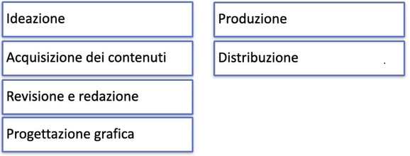
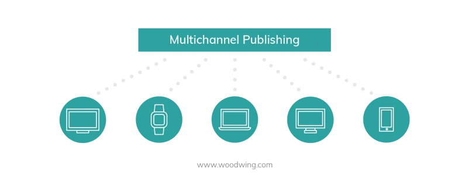
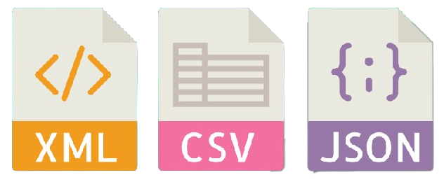
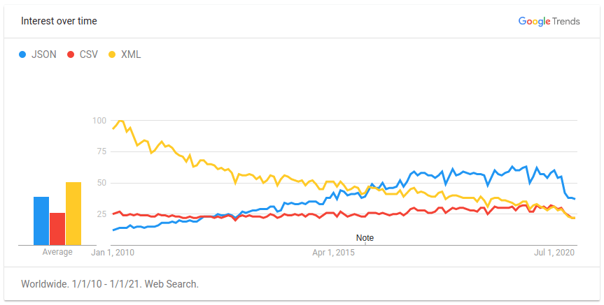
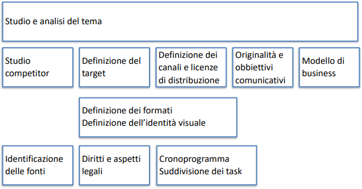
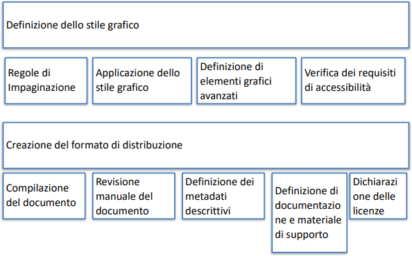
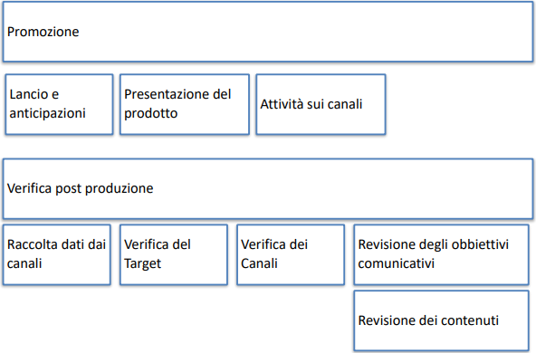

# Produzione Editoriale

Il processo di produzione editoriale è il complesso insieme di attività coinvolte nella ideazione, sviluppo, e distribuzione di materiali editoriali come libri, riviste, giornali, manuali, …
La sfida è fare in modo che l’opera passi dal concepimento alla sua disponibilità per il pubblico
Il processo può variare, tradizionalmente le fasi chiave sono:

## Multicanalità

Nell’attuale contesto economico e tecnologico la multicanalità è un concetto chiave

- <u>Consente di raggiungere diversi segmenti di mercato</u>
  
  Il consumatore si differenzia per bisogni, cultura, predisposizione alla spesa
  
- <u>Consente di tenere in considerazione le diverse forme di espressione</u>
  
  Contenuti diversi hanno diverso grado di fruibilità su diversi canali e sulla base del contesto di fruizione
  

## Portabilità

Un requisito tecnico che facilità la multicaniltà e la portabilità dei formati adottati
nei contenuti.
La portabilità si riferisce alla capacità di un dispositivo, di un'applicazione software o di dati di essere facilmente spostati o trasferiti da un sistema, piattaforma o posizione all'altra senza significativi problemi di compatibilità o usabilità.

- Questo è importante tanto nella fase di fruizione del contenuto da parte dell’utente quanto nella fase di produzione del contenuto
  
- Permette di ottenere un processo di produzione più resiliente e meno dipendente dai lock-in realizzati dagli attori tecnologici
  
- Permette di sfruttare al massimo i processi basati sulla esternalità della rete
  
- <u>Riduce i costi di produzione e allarga la capacità di penetrazione del mercato</u>
  

Per valutare la portabilità di una tecnologia bisogna considerare sia **aspetti sincronici**
che **diacronici**

### Aspetti Sincronici

- **Standard e compatibilità**. Gli standard tecnici e la compatibilità con altre tecnologie esistenti sono aspetti critici della portabilità attuale di una tecnologia. Una tecnologia che si adatta facilmente a norme e protocolli esistenti è più portatile
  
- **Usabilità e risorse**. La facilità d’uso influenza l’adozione di una tecnologia. La quantità di risorse necessarie per far funzionare una tecnologia, come hardware, software, potenza di calcolo, connettività, ecc., è rilevante per la sua portabilità
  
- **Condizioni di mercato**. Le condizioni di mercato, comprese le esigenze dei clienti e le tendenze del settore, possono influenzare la portabilità di una tecnologia in un dato momento
  
- **Normative e leggi**. Le leggi e le normative locali e internazionali possono influenzare la portabilità di una tecnologia, ad esempio, per quanto riguarda la privacy dei dati o la sicurezza
  

### Aspetti Diacronici

- **Sviluppo tecnologico**. L'evoluzione della tecnologia nel corso del tempo è un aspetto importante.
  
  *Esempio*: il passaggio da dispositivi desktop a dispositivi mobili, da
  rappresentazioni 2D a rappresentazioni 3D degli contenuti visuali
  
- **Condizioni di mercato**. Capire quali attori del mercato possono trarre vantaggi dallo sviluppo di una tecnologia è fondamentale per capire quali sinergie si potranno produrre nel mercato.
  
  *Esempio*: lo sviluppo dei podcast porta ad un aumento del bisogno di servizi di manipolazione di contenuti audio
  
- **Cambiamenti culturali e sociali.** I cambiamenti nella cultura e nella società influenzano come una tecnologia è percepita e utilizzata.
  
  *Esempio*: i social inizialmente percepiti come strumenti di arricchimento culturale oggi sono spesso ritenuti fonte di omologazione
  
- **Evoluzione delle normative**. Prevedere le evoluzioni normative può essere molto
  importante.
  
  *Esempio:* AI Act della UE potrebbe vietare l’uso di applicazioni AI in certi contesti
  

## Automazione

Nella produzione editoriale possono esistere diversi flussi di creazione e gestione dei documenti.
Differiscono in base a:

- Flusso di lavoro
  
  - Qualità contenuti    
  - Qualità formati (*Esempio*: citazioni)
    
- Tecnologie
  
  - Creazione
  - Condivisione
  - Produzione
    
Qualità richiesta e tecnologia adottata influiscono in modo inversamente proporzionale sul tempo di gestione documentale.

## Ideazione e acquisizione dei contenuti

## Studio e analisi del tema

Per analizzare il tema è utile osservare come questo viene trattato nelle comunità di riferimento:

- Ricerca avanzata
  
  - [Ricerca Avanzata Google](https://www.google.com/advanced_search)
  - [Lista completa degli operatori di ricerca Google](https://ahrefs.com/blog/it/operatori-ricerca-avanzata-google/)
  - [Ricerca avanzata Twitter](https://twitter.com/search-advanced)
    
- Tool di monitoraggio

  - [Answer the public](https://answerthepublic.com/) : Statistiche su quello che le persone chiedono a Google, Youtube e Bing
  - [Socialbearing](https://socialbearing.com/) : Approfondimenti e analisi per tweet e timeline
  - [Twitonomy](https://www.twitonomy.com/) : Analytics di Twitter
  - [Followerwonk](https://followerwonk.com/) : Analytics per follower di Twitter
  - [Semrush](https://www.semrush.com/) : Strumenti per SEO, content marketing, ricerca sulla concorrenza, pubblicità online e social media marketing
    

In questo modo possiamo identificare i competitor, il target, le comunità di riferimento e il customer journey

## Gestione documentale

## Progettazione grafica e produzione

## Distribuzione

