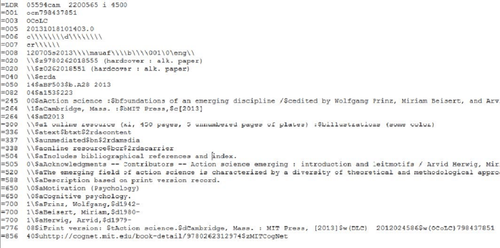
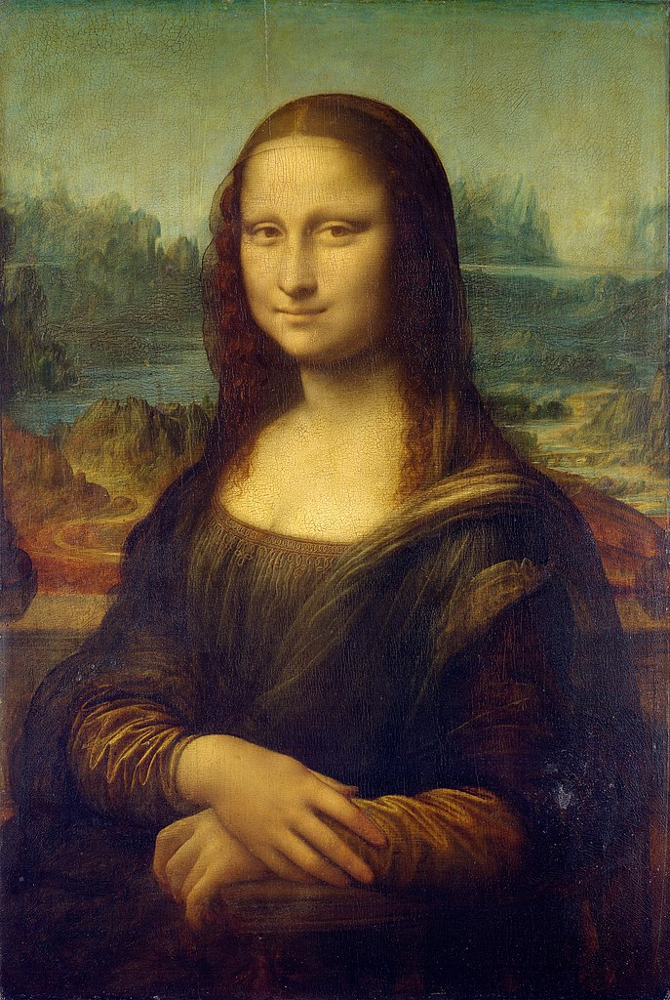
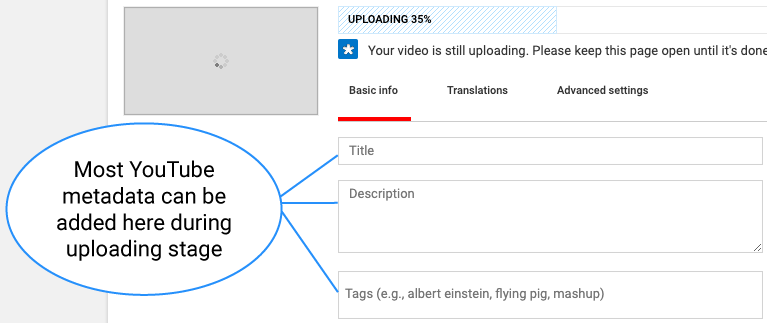
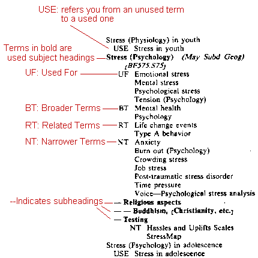
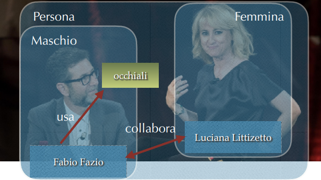

# Flussi di Gestione Documentale

## Gestione documentale
Nella produzione editoriale possono esistere diversi flussi di creazione e gestione dei documenti.
Differiscono in base a:
- Flusso di lavoro
  - Qualità contenuti
  - Qualità formati (*Es.* citazioni)
- Tecnologie
  - Creazione
  - Condivisione
  - Produzione

# Metadati

I metadati sono ovunque, a volte invisibili ma presenti.

## *Esempi*
- Questa lezione ha un titolo, un docente, una durata, dei CdL
- Un video su YouTube
  - Titolo, autore, data, durata, categorie e licenze
  - Metadati generati dall’autore, scelti da una lista limitata, i commenti creati da altri, metadati generati automaticamente dal sistema
- Una risorsa di archivio
  - Il principe, Nicolò Machiavelli
  - https://archive.org/details/ilprincipe04machgoog

- Alcuni descrittori sono comuni a diverse categorie di oggetti.
  - Autore, titolo, data
- Altri sono specifiche del tipo dell’oggetto.
  - Durata di un video, il numero delle pagine di un libro
- Alcuni sono stabili nel tempo altri variano
  - Autore, soggetto *vs* commenti, voci correlate, recensioni
- Alcuni valgono per ogni tipo di interazione altri dipendono dall’interazione
  - Titolo del corso *vs* Corso di Laurea
- Alcuni dipendono dal processo di raccolta
  - Tabulati telefonici

## Il caso dei tabulati telefonici
- Nei tabulati telefonici non si raccoglie il contenuto delle telefonate
- Si raccolgono i metadati di queste telefonate
  - Il numero da cui parte la telefonata
  - Il numero cui si telefona
  - Il ripetitore che trasmette la telefonata e che consente di definire l’area geografica
  - L’ora e la durata della telefonata​


> (A) Traccia di un utente di telefonia mobile anonimizzato durante un giorno. I punti rappresentano gli orari e i luoghi in cui l'utente ha effettuato o ricevuto una chiamata. Ogni volta che l'utente ha un'interazione di questo tipo, viene registrata l'antenna più vicina che instrada la chiamata.
<br/>  
(B) La traccia dello stesso utente registrata in un database della mobilità. Il reticolo di Voronoi, rappresentato dalle linee grigie, è un'approssimazione delle aree di ricezione delle antenne, l'informazione di localizzazione più precisa a nostra disposizione. I tempi di interazione dell'utente sono qui registrati con una precisione di un'ora.
<br/> 
(C) La traccia dello stesso individuo quando abbassiamo la risoluzione del nostro set di dati attraverso l'aggregazione spaziale e temporale. Le antenne vengono aggregate in cluster di dimensione due e le regioni associate vengono unite. Le interazioni dell'utente sono registrate con una precisione di due ore. L'aggregazione spaziale e temporale rende indistinguibili le interazioni delle 8:32 e delle 9:15 del mattino.

Source: [Unique in the crowd: the privacy bounds of human mobility](http://www.nature.com/articles/srep01376)

## Metadati sono dati
- Metadati sono dati sui dati
  - Metadati sono descrizioni di un oggetto
    
  - Le descrizioni sono affermazioni su un oggetto, informazioni sull’oggetto
  - Siccome possiamo collegare oggetti a risorse informative che li descrivono e identificano possiamo dire che i metadati possono riferirsi a qualsiasi oggetto
    - Questa risorsa è un libro
    - Questo libro ha un autore
    - Questo autore ha un nome

​

### Cosa sono i dati e cosa i metadati
Il censimento raccoglie metadati descrittivi sulla famiglia
- Queste info rese pubbliche diventano dati
  - I metadati sono diventati dati
- **Conclusione:** cosa siano i dati e cosa siano i metadati dipende dal punto di vista

​

## Perché i metadati
- Per potere catalogare e concettualizzare i dati
  - Necessità di punti di accesso per ritrovare i dati
  - Necessità di un vocabolario condiviso per rendere interoperabile lo scambio di informazioni e per attivare processi di automazione
    <br/>[Documentazione crossref](https://www.crossref.org/documentation/)
- Per potere disporre l’uso dei dati
  - Necessità di gestire il ciclo di vita di un dato: revisioni, versioning, autorizzazioni, diritti d’uso
  - Necessità di strumenti di validazione per verificare l’integrità del dato, la sua compatibilità con altri dati, l’autenticità

## Tipi di metadati
- Ci sono diverse tipologie di metadati  
  - Descrittivi    
  - Strutturali    
  - Amministrativi
  - Tecnici    
  - Utilizzo


[Esempi](https://www.getty.edu/publications/intrometadata/setting-the-stage/)

## Oggetto vs. Collezione
- Una distinzione importante nella descrizione
  - Item è un singolo oggetto
  - Collezione è una raccolta di oggetti
- Un articolo vs il giornale
  - http://firstmonday.org/ojs/index.php/fm/index
- Una fotografia vs l’intera esibizione
  - http://exhibitions.europeana.eu/exhibits/show/europe-america-e

## Classificazione multiple
Ogni oggetto può essere classificato da diversi punti di vista e quindi essere descritto con diversi vocabolari controllati.
- Un monumento classificato dal punto di vista della locazione geografica, dello stile architettonico, dell’uso, dei materiali usati...
- Un *esempio* di classificazione multipla è data dall’Art & Architecture Thesaurus del Paul Getty Institute che si trova online: http://www.getty.edu/vow/AATHierarchy

## Standard per metadati
|     |     |
| --- | --- |
| __Standard di strutturazione dei dati__ | MARC (Machine-Readable Cataloging) Format, Encoded Archival Description (EAD), BIBFRAME (Bibliographic Framework), Dublin Core Metadata Element Set, Categories for the Description of Works of Art, VRA Core |
| __Standard di valori dei dati (vocabolari controllati, thesauri, liste controllate)__ | Library of Congress Subject Headings, Name Authority File, and Thesaurus for Graphic Materials; Getty Art & Architecture Thesaurus, Union List of Artist Names (ULAN), and Thesaurus of Geographic Names; ICONCLASS; Medical |
| __Standard di organizzazione sintattica dei dati (regole e codici di__ | Anglo-American Cataloguing Rules, Resource Description and Access, International Standard Bibliographic Description, Cataloging Cultural Objects, Describing Archives: A Content Standard |
| __Formato dei dati/standard tecnici di interscambio__ | Resource Description Framework, MARC21, MARCXML, EAD XML DTD, METS, BIBFRAME, LIDO XML, Simple Dublin Core XML, Qualified Dublin Core XML, VRA Core 4.0 XML |

### Standard MARC
Un formato di catalogazione introdotto negli anni ‘60 dal US Library of Congress.
- Divenuto standard internazionale negli anni ’70
- Evoluto in una famiglia di standard: http://www.loc.gov/marc/umb/
- Una tipica scheda include:
  - La descrizione dell’oggetto
  - I campi principali, access point
  - Le parole chiave per soggetto
  - La classificazione e il numero di catalogazione
  - Molte altre informazioni


​
### Lo standard Dublin Core
- Dublin, Ohio; quartier generale di OCLC – Online Computer Library Center
  - Non profit org., proprietari del sistema decimale Dewey; 
    FirstSearch e WorldCat, portali a diversi cataloghi
  - Workshop, marzo 1995. Come descrivere, organizzare e dare accesso all’informazione attraverso la rete
  - Mosaic, 1993: quindi il contesto web era poco conosciuto
- Definire uno standard per descrivere oggetti su scala web: a livello core cioè il minimo insieme di descrittori necessario per descrivere qualunque risorsa in rete

#### Scopo del Dublin Core
- Semplicità
  - Basso costo di adozione tanto da non avere scuse
  - Basso costo per implementarla in applicativi di ricerca che la usano
  - Solo 15 elementi di metadati
- Semantica condivisa
  - Generalista e di conseguenza con perdita di specializzazione ma incremento di usabilità
- Estendibile
  - Anche per ovviare alla perdita di specializzazione
- Internazionale
  - Con possibilità di traduzione in più lingue, ma per lo più sviluppata in lingua inglese

#### Gli elementi di Dublin Core
- Contributor
- Publisher
- Coverage
- Relation
- Creator
- Rights
- Date
- Source
- Description
- Subject
- Format
- Title
- Identifier
- Type
- Language

[Documentazione Dublin Core](https://www.dublincore.org/specifications/dublin-core/dces/)

## Elementi, Valori, Records
Quando si descrive qualcosa si formula una frase. Uno schema di metadati controlla il tipo di frasi che si possono formulare e come.
Un vocabolario controllato per controllare i termini che si possono usare nella frase
 - Elemento
   - La categoria di frase che si può usare in uno schema di metadati per descrivere un oggetto
   - DC usa solo 15 elementi per formulare frasi ben formate
 - Valore
   - Le informazioni, i parametri che si passano all’elemento
   - DC spesso suggerisce di usare specifici vocabolari controllati
 - Record
   - L’insieme delle coppie Elemento/Valore, cioè le frasi che si possono usare per zescrivere le risorsa

#### *Esempio*

>Title: Monna Franky
<br/> Creator: Leonardo da Vinci
<br/> Subject: Franky del Giocondo
<br/> Description: ritratto di donna
<br/> Date: c. 1503-1506
<br/> ....
<br/> ....

*Le coppie elemento/valore sono ripetibili e in qualunque ordine*

### Principi di rilevanza
- Includere solo informazioni rilevanti – semplificare (principio dumb-down )
  - Subject non è rilevante per la descrizione di uno spartito?
  - Language non è rilevante per descrivere un dipinto?  
  Tralasciamo...
- Per ogni risorsa ci deve essere uno e un solo record che la descrive
  - No allo stesso record per due risorse
  - No a due record per la stessa risorsa

#### *Esempio*

> Title: Monna Franky
<br/> Creator: Leonardo da Vinci
<br/> Subject: Franky del Giocondo
<br/> Description: ritratto di donna
<br/> Publisher:
<br/> Contributor:
<br/> Date: c. 1503-1506
<br/> Type:
<br/> Format: olio su legno di pioppo
<br/> Identifier:
<br/> Source:
<br/> Language:
<br/> Relation:
<br/> Coverage:
<br/> Rights: Musée du Louvre

## DC in HTML

```
<html>
 <head>
 <title>Record del dipinto di Leonardo</title>
 <meta name=“DC.creator” content=“Leonardo, da Vinci, 
  1452-1519”>
 
 
 <meta name=“DC.date” content=“c. 1503-1506”>
 <meta name=“DC.format” content=“olio su legno”>
 </head>
 <body> contenuto della pagina web </body>
</html>
```

### *Esempio*

> Title: Monna Franky
<br/> Creator: Leonardo da Vinci
<br/> Subject: Franky del Giocondo
<br/> Description: ritratto di donna
<br/> Date: c. 1503-1506
<br/> Format: olio su legno di pioppo
<br/> Rights: Musée du Louvre

</br></br>


> Title: Monna Franky
<br/> Creator: chi ha creato img digitale
<br/> Subject: Franky del Giocondo
<br/> Description: ritratto di donna
<br/> Contributor: Leonardo da Vinci
<br/> Publisher: Musée du Louvre
<br/> Type: image
<br/> Date: 2014
<br/> Format: JPEG
<br/> Identifier: URI dell’immagine
<br/> Relation: URI ad altra risorsa
<br/> Rights: Musée du Louvre

**Un record per l’originale, un record per l’immagine digitale e la relazione tra i due. L’immagine digitale è una rappresentazione dell’original**

### Schema.org
- Diversi motori di ricerca come Google, Bing, Yahoo sono in grado di interpretare le descrizioni di alcune tipologie di contenuti se seguono lo schema definito da schema.org
- Queste descrizioni possono essere associate ad una pagina HTML usando diversi formati, il più diffuso sta diventando JSON-LD
  <br/> [Introduzione al markup dei dati strutturati nella Ricerca Google](https://developers.google.com/search/docs/guides/intro-structured-data)
  <br/> [JSON-LD Playground](https://json-ld.org/playground/)
- In questo modo i motori di ricerca possono costruire strutture dati più significative come Breadcrumbs, Sitelinks Search Box, Rich Card, Rich Snippets o (Google Knowledge Graph)

#### *Esempio*

Le informazioni relative alle diverse aree di un sito sono costruite grazie ai metadati.

- È possibile verificare la struttura dei metadati utilizzando [Rich Results Test](https://search.google.com/test/rich-results) di Google o lo [Schema Markup Validator](https://validator.schema.org/) di schema.org
- È possibile verificare l’impatto sulle poiché di SEO utilizzando
  [Google Search Console](https://search.google.com/search-console/welcome)
  

## Vocabolari non controllati
Ogni parola e ogni frase può essere usata per classificare
 - Al contrario dei vocabolari controllati in cui le parole usate per descrivere sono limitate
 - I tag delle reti sociali sono un esempio di vocabolario non controllato:
  -  YouTube non limita nell’uso di parole chiave
  - FaceBook limita a termini che devono già essere stati coniati nell’universo FB
  - Twitter usa gli hashtag, non tutti i tag sono descrittivi. A metà strada tra contenuto e metadato
  - Flicker usa tag completamente liberi

*Esempio*: Metadati di Youtube


## Tesauro o vocabolario controllato
- Definisce le entità dell’universo che trattiamo e indica le parole che dobbiamo usare per parlarne
- LCSH (Library of Congress Subject Headings) fornisce la struttura di parole per definire i soggetti, che può essere modificata ed estesa, mediante un vocabolario controllato e strutturato
- Un elenco strutturato di parole, raggruppate per semantica, con alcune relazioni:
  - BT: broader term, il termine più generale
  - NT: narrower term, il termine più specifico
  - RT: related term, un termine associato
  - USE: rimando a un termine da usarsi
  - UF: use for, rimando a un termine da non usarsi

## Il vocabolario controllato LCSH
LCSH dal 1898 il prototipo di un sistema di metadati per la catalogazione del materiale librario.
- Da non confondere con la classificazione per collocare gli oggetti sugli scaffali, Library of Congress Classification
- Fornisce l’identificativo alfa-numerico, call number, o collocazione, che viene posto sul dorso dei libri per poterli ritrovare negli scaffali
- Definito da Putnam nel 1897



## Ontologie
Nell’ingegneria della conoscenza, la rappresentazione formale di un insieme di concetti in un determinato ambito.
- Un insieme di termini di relazioni più complesse di quelle nei vocabolari controllati
  - Sussunzione: super- o sub-class
  - Meronimia: part-of
  - Istanziazione: type-of
  - Relazioni: simmetria, transitivi, riflessività
*Esempi*
- [Ontologia della birra](http://www.cs.umd.edu/projects/plus/SHOE/onts/beer1.0.html)
- [Ontologia per descrivere le persone che usa inferenze per stabilire fatti nuovi implicati da quelli noti](http://www.cs.umd.edu/projects/plus/SHOE/onts/personal1.0.html)

## Tesauri vs Ontologie
Le ontologie sono tesauri con relazioni formali: esprimono sottoinsiemi della logica del primo ordine.
 - Nelle ontologie entità, relazioni e inferenze consentono di dedurre fatti non esplicitamente asseriti.
Le ontologie possono quindi essere usate in algoritmi, alcuni linguaggi
- [OWL](https://www.w3.org/TR/owl-ref/)
- [SWRL](https://www.w3.org/Submission/SWRL/)
- Alcuni formati di sterilizzazione:
  - [RDF](https://www.w3.org/TR/rdf11-concepts/)
  - [Turtle](https://www.w3.org/TR/turtle/)

## *Esempio di concettualizzazione*

1. Identifichiamo Fabio Fazio e Luciana Littizzetto
2. Che sono un maschio e una femmina
3. Che sono persone
4. Che collaborano tra loro
5. Fabio Fazio usa degli occhiali

## Identificare
Identificare un oggetto:
> https://it.wikipedia.org/wiki/Fabio_Fazio
> https://it.wikipedia.org/wiki/Luciana_Littizzetto

Si tratta di associare un oggetto o risorsa ad un identificatore che potrà essere utilizzato in modo univoco all’interno del vocabolario.
Molti sono i criteri che si possono usare per decidere cosa considerare individuo:
- un oggetto indivisible
- un’unità che non ammette riduzioni nel sistema di riferimento
- un oggetto che ha una condizione di identità
- un oggetto che è associato ad un identificatore
Solitamente si considera individuo qualche cosa che permane (che identifichiamo all’interno di uno sfondo mutevole, o irrilevante, o composto da altri oggetti identificati)

## Classificare
> https://it.wikipedia.org/wiki/Fabio_Fazio **type** https://it.wikipedia.org/wiki/Maschio
> https://it.wikipedia.org/wiki/Luciana_Littizzetto **type**  https://it.wikipedia.org/wiki/Femmina

Si tratta di affermare che un oggetto appartiene ad una classe di oggetti: ovvero **condivide con altri oggetti uno stesso insieme di proprietà**
In una **buona classificazione** l’insieme di proprietà definito dalle classi dovrebbe essere:
- reciprocamente esclusivo
- congiuntamente esaustivo
- pertinente
In realtà quasi tutti i vocabolari includono diverse criteri di classificazione, diverse dimensioni o punti di osservazioni, quindi ammettono intersezioni tra le classi che appartengono a dimensioni diverse.
