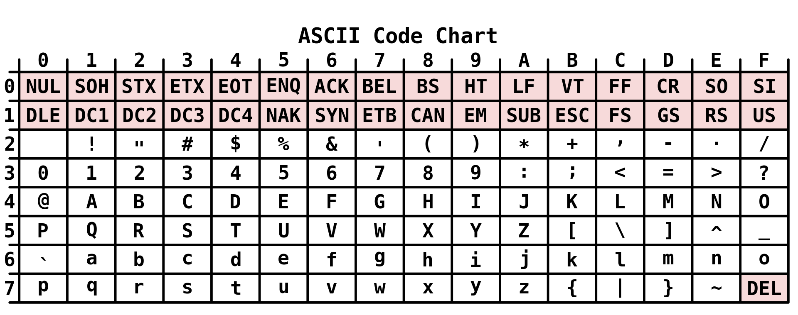
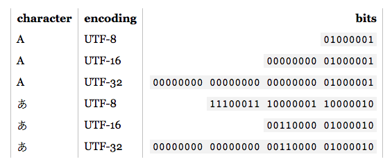

# Codifica del Testo

## Il file

Un file è l’unità di dati elementare gestita dal file system ed è caratterizzato da:

- un **contenuto**, cioè una sequenza di byte
- un **identificatore**, unico per ogni file

I dati contenuti nel file devono essere opportunamente interpretati.

Le regole con cui interpretare il file sono chiamate formato del file.

**Formato dei file** = codifica convenzionale di informazioni adottata da un'applicazione.

## File binari

- può contenere qualsiasi tipo di dati, codificato in codice binario a scopo di archiviazione o utilizzo.
- solitamente sono concepiti come sequenze di byte: le singole cifre bit che costituiscono il file sono raggruppate in gruppi di otto.
- alcuni contengono header, cioè contenitori di metadati usati dai programmi associati ai file per riconoscerne ed interpretarne il contenuto.  
  *Esempio:* un file GIF può contenere più immagini, e gli header sono utilizzati per identificare e descrivere ciascun blocco di dati.

## File di testo

- contiene solo caratteri alfabetici, che compongono un testo leggibile direttamente dagli utenti
- non hanno bisogno di installare programmi appositi
- sono molto utilizzati per
  - file indirizzati all'utente,
  - documenti
  - codice sorgente
- garantiscono una buona portabilità tra SO

## File eseguibile

- contiene un programma eseguibile per un computer, cioè un programma scritto in linguaggio macchina nel formato adatto ad essere caricato dal sistema operativo
- gli eseguibili sono dipendenti dalla piattaforma  
  *Esempio:* un file eseguibile per un sistema Microsoft Windows non è direttamente utilizzabile in sistemi Unix o Mac OS (a meno di non usare un software di emulazione).

Questa restrizione è dovuta a tre motivi:

- processori diversi supportano linguaggi macchina diversi
- sistemi operativi diversi usano formati diversi per i file eseguibili
- per effettuare operazioni di base (input/output) i programmi eseguibili devono avvalersi delle primitive fornite dal sistema operativo

## Portabilità

Cosa rende un file portabile?

<ul>
  <li>Il livello di supporto nei sistemi operativi  
   <i>Esempi: </i> I file di testo sono supportati da tuti i sistemi operativi e concorrono al funzionamento del sistema stesso
  </li>
 <li>
  Il livello di diffusione di uno standard  
  <i>Esempi: </i> PDF e DOC sono ad esempio molto diffusi  
 </li>
 <li>
  Il livello di variabilità nelle versioni di uno standard  
  <i>Esempi: </i>
    <ul>
     <li> Vecchie versioni di DOC non sono più supportate oggi </li>
     <li> Vecchie versioni di PDF sono ancora compatibili con gli interpreti attuali </li>
    </ul>
 </li>
</ul>

## Codifica

Parlare di formato di file significa parlare dello schema di codifica necessario per interpretarlo.

> La codifica è quel processo che ci permette di esprimere informazioni e messaggi mediante le regole e i simboli di un sistema convenzionale (il codice) stabilito concordemente dall’emettitore e dal ricevitore dei messaggi allo scopo di trasmettere o elaborare automaticamente le informazioni - Treccani

I formati di testo sono quelli più portabili e sono stati storicamente utilizzati per facilitare l’interoperabilità dei sistemi

<ul>
 <li>ASCII nel modello ISO/OSI </li>
 <li>HTML nel WWW</li>
 <li>JSON nel Web 2.0</li>
</ul>

## Codifica del testo
Nei calcolatori il testo è memorizzato come sequenza binaria, la codifica del testo si occupa di definire la corrispondenza tra una sequenza binaria e il corrispondente carattere alfanumerico

*Esempio:*
- Per la codifica Windows-1252, il carattere “é” è salvato in memoria usando la sequela binaria che in esadecimale corrisponde al valore “E9”
- Per la codifica DOS latin-1, il valore “E9” corrisponde al carattere “Ú”

La difficoltà è quindi duplice:

- È necessario **scegliere** con cura, a seconda dell'applicazione di destinazione, la **codifica da utilizzare** quando si salva un testo 
- Quando è il momento di visualizzare un testo, è necessario **poter determinare la codifica utilizzata**

## Codifica ASCII 

**Quantità di informazione da rappresentare** (considerando l’alfabeto inglese): 

26 lettere +  
26 lettere maiuscole +  
10 cifre decimali +  
30 caratteri circa di uso comune (., *, %, etc.) +  
alcuni caratteri di controllo (spazi, interruzione di riga)  
= 120 caratteri circa
 
<ins> Numero di BIT necessari </ins>: bastano 7 bit poiché 27 = 128 > 120  
Su questa base è stato creato il codice ASCII, basato appunto sull’uso di 7 bit per ogni carattere.

*Esempi:*

| Carattere |  Codice |
|:---------:|:-------:|
|     A     | 1000001 |
|     B     | 1000010 |
|     b     | 1100000 |

### Limiti di ASCII 

La globalizzazione di Internet ha proposto il problema di rendere correttamente gli alfabeti di migliaia di lingue nel mondo.

Poiché i 7 bit usati da ASCII consentono di rappresentare solo 128 caratteri diversi, sono stati definiti nel tempo altri codici per consentire la rappresentazione di più caratteri

**ASCII esteso**: usa 8 bit (un BYTE) per carattere. Consente quindi di rappresentare anche caratteri accentati e lingue diverse dall’inglese.

### Altre codifiche storiche 

#### EBCDIC (Extended Binary Characters for Digital Interchange Code)

**Extended Binary Characters for Digital Interchange Code**, codifica proprietaria IBM del 1965 a 8 bit. IBM è molto sicura della superiorità dei suoi chip e si azzarda fin dagli anni cinquanta ad usare tutti e 8 i bit del byte

#### ISO 646

Una **codifica ISO del 1991** che permettere l'uso di caratteri nazionali europei in un contesto sostanzialmente ASCII. Sono lasciati 12 codici liberi per le versioni nazionali dei vari linguaggi europei. Ogni versione nazionale li sostituisce con caratteri propri. I caratteri sacrificati sono: # $ @ \ ¬ ` { | } ~

#### ISO 8859/1

Più comunemente **ISO Latin 1** è un estensione standard dell’ASCII che comprende un certo numero di caratteri degli alfabeti europei. È compatibile all’indietro con ASCII: estende i soli caratteri >127

## UNICODE

Lo standard Unicode definisce tre codifiche che consentono a uno stesso dato di essere trasferito utilizzando un vocabolario basato su 1, 2 o 4 byte: UTF-8, UTF-16, UTF-32. Queste tre codifiche descrivono gli stessi caratteri e possono essere trasformate efficientemente una nell'altra.

### Caratteristiche

- **Composizione dinamica**. Alcuni caratteri (in arabo, in cinese, ma anche, banalmente, le lettere accentate o con modificatori degli alfabeti europei) sono composizioni di codifiche indipendenti. In certi casi ricorrere ad un doppio codice per un carattere composto è eccessivo. Per i simboli di uso frequente esiste un singolo carattere equivalente

- **Semantica**. Ogni carattere possiede un suo significato preciso (la ß tedesca è diversa dalla ß greca) nonché proprietà come direzione, esigenze di spaziatura, capacità di combinazione

- **Convertibilità**. Esiste un meccanismo di conversione tra Unicode e altre codifiche precedenti, in modo da garantire compatibilità all’indietro

### Codifiche

#### UTF-8
Caratteri codificati da 1 byte (8 bit) per i più frequenti, poi 2, 3 e 4 per i meno frequenti. 
Usato molto nel WEB. Ha il vantaggio che il set di caratteri ASCII mantiene la stessa codifica, può quindi essere usato su vecchie applicazioni. Ma non si accede direttamente a una codifica prima si deve codificare come raggruppare i byte

#### UTF-16
Caratteri codificati da 2 byte (16 bit) e 4 byte per i meno frequenti. 
Usato per situazioni dove si vuole bilanciare l'uso di memoria con la velocità di accesso ai dati

#### UTF-32
Caratteri codificati da 4 byte (32 bit). 
Usato quando non si ritiene di avere problemi di memoria oppure se si fa uso di vocabolari poco frequenti

## Problemi di codifica

Se UNICODE è uno standard universale, in grado di rappresentare i caratteri di tutti gli alfabeti, perché ci sono ancora problemi di codifica?
- Il motivo principale è che i vecchi sistemi non si sono necessariamente evoluti contemporaneamente alla rivoluzione Unicode
- Microsoft si è presa la libertà di creare le proprie tabelle di caratteri derivate dalle tabelle ISO-8859-x.  
Quindi, l'invio di un file di testo Windows a un server Linux o a un'applicazione proprietaria può facilmente generare disalineamenti
- Data l’ampia numerosità di caratteri presenti in UNICODE, i font dei caratteri non sempre sono prodotti per l’intero set, quindi alcuni font possono essere applicati solo a specifici sottoinsiemi di UNICODE
- **Byte Order Mark (BOM)** è una sequenza di byte UNICODE non stampabili posta all'inizio di un testo UNICODE per facilitarne l'interpretazione.  
BOM non è né standard né obbligatorio, ma rende più facile per le applicazioni compatibili determinare il sottotipo del formato Unicode e definire la direzione di lettura dei byte.  
Questo spesso causa problemi di compatibilità perché non tutte le applicazioni sanno come gestire BOM. Per le applicazioni non compatibili, questa sequenza di byte viene decodificata in ASCII esteso

## Determinare codifica di un file

**Indipendentemente dall'origine di un file**, può essere utile verificare con assoluta certezza il suo formato e mostrare l'eventuale tag BOM.

Se all'inizio del file è presente un tag BOM, si tratta di un testo in formato Unicode:

- UTF-8 = EF BB BF
- UTF-16 Big Endian = FE FF
- UTF-16 Little Endian = FF FE
- UTF-32 Big Endian = 00 00 FE FF 
- UTF-32 Little Endian = FF FE 00 00

Premere [qui](https://validator.w3.org/i18n-checker/) per accedere al validatore di W3C

- L’assenza del BOM **non consente** di stabilire che il file non sia codificato in UNICODE
- Rimuoverlo può aumentare la compatibilità con le applicazioni
