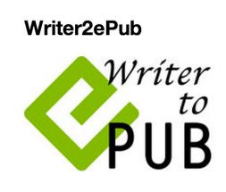
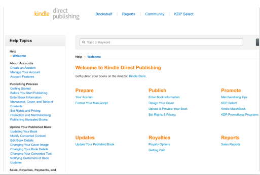

# LIBRO DIGITALE

## IL LIBRO ELETTRONICO
Il libro elettronico è un *documento digitale* per la lettura.

Il formato principale prende il nome di **ePUB** ed è stato definito dal **W3C**, anche Kindle conosciuto come **MOBI** o **AZW** è comunque importante

Questi documenti vengono distribuiti principalmente attraverso piattaforme chiuse accessibili mediante PC, dispositivi mobili o dispositivi dedicati

## INTERFACCIA
Le informazioni contenute all'interno del'testo vengono proposte attraverso un interfaccia che ha l'obbiettivo di replicare l'esperienza di lettura di un testo su carta
alcune funzionalità riprodotte sono:

- Sfogliare le pagine
- Posizionare un segnalibro
- Accesso random al contenuto
- Annotazioni

Vengono anche introdotte nuove funzionalità come:

- Ipertestualità
- Multimedialità
- Integrazione con dizionari e tesauri

## IDEAZIONE

Nei racconti e nei film troviamo diverse anticipazioni delle invenzioni tecnologiche:

-  Il cadetto dello spazio, 1948 di Robert Heinlein: racconto in cui troviamo telefoni cellulari e un sistema che proietta i testi sui banchi di scuola
- Chissà come si divertivano!, 1951 di Isaac Asimov: un racconto ambientato nel 2157 in cui si parla del ritrovamento di un antico libro a stampa
- Ritorno dall’universo, 1961 di Stanislaw Lem: racconto in cui si descrivono lettori con sintesi vocali (optoni e lectoni) e librerie digitali 
- 2001: Odissea nello spazio, 1968 romanzo di Arthur Clarke e film di Stanley Kubrick: il newspad
- Star Trek, serie TV del 1966 e film 2009: i PADD
- Cyberbooks, 1989 di Ben Bova: romanzo in cui è centrale l’idea di libro elettronico
- Minority Report, 2002 di Spielberg: quotidiano elettronico

Nelle tappe di avvicinamento all’e-book troviamo lavori pionieristici e intuizioni da fantascienza:

- Nel 1930 Bob Brown, sul giornale di avanguardia transition propone l’idea di una macchina portatile in grado di leggere testi di diverse dimensioni

- Nel 1949 Angela Ruiz Robles, una maestra spagnola realizza il primo lettore automatizzato. Piccole quantità di testo sono stampate su bobine e azionate da aria compressa che vengono.

- Memex, anni ‘40 di Vannevar Bush: dispositivo di lettura di testi conservati su microfilm, per semplificare ritrovamento e organizzazione dei testi. Più vicino all’idea di ipertesto che al libro

  

Studio delle interfacce di lettura e digitalizzazione elettronica dei testi:

- Alan Kay, anni ‘70, al PARC della Xerox, quando i computer erano grandi
  mainframe lavora all’idea di una informatica personale e di strumenti
  portatili. Dynabook strumento personale multifunzionale
- Michael Hart, anni ‘70, contributo fondamentale all’idea della
  digitalizzazione dei testi, iniziatore del Progetto Gutenberg, strumento
  per valorizzare il ruolo delle tecnologie e la rete per la di usione del libro

L'ebook necessita anche di un punto di accesso, uno store:

- Nel 1993 BiblioBytes lancia il primo sito web che propone eBook
- Nel 1994 nasce Amazon, nel 1995 la prima libreria online
- Nel 1999, la casa editrice Simon & Schuster crea "ibooks" una iniziativa per pubblicare
  contemporaneamente titoli in formato eBook e cartaceo. La Oxford University Press ha o erto
  alcuni dei suoi libri attraverso un sistema chiamato netLibrary su Internet
- Il 1998 ha segnato il futuro degli eBook: sono stati lanciati i primi lettori di eBook, gli eBook
  hanno ottenuto l'ISBN, le biblioteche statunitensi hanno iniziato a fornire eBook gratuiti al
  pubblico
- Sony lancia il suo primo e-reader nel 2004
- Il mercatoNello stesso anno il lancio e il successo di iPhone dimostra il potenziale dei dispositivi digitali mobili
- Kobo (anagramma della parola book) dal 2010
- In Italia accordo con Mondadori e IBS.it per Pocketbook, Leggo **qui mettere link per ibs**

## DISPOSITIVI

- I lettori di libri digitali prendono il nome di **eReader** : dispositivi per la lettura di testi
- Basato su tecnologia per la visualizzazione dei caratteri, E-Ink,
  che non emette luce come un normale display dello schermo
  ma ri ette la luce ambientale come un foglio di carta.
- Tecnologia inventata da Jacobson, 1996, fondatore di E-Ink
- Adottata da quasi tutti i dispositivi eReader, generalmente a
  16 tonalità di grigio

## FORMATI

Distinguiamo tra **formati immagine** e **formati di testo**:

- *DjVu*, formato immagine compresso che rappresenta l’immagine a livelli, usato
  per testi con alto contenuto gra co, supporta le funzioni di:
  - zoom, rotazione, salvataggio, esportazione, stampa
  - separazione del testo dallo sfondo e anche la ricerca su tutto il testo, se
    l’immagine è stata trattata con un sistema di riconoscimento ottico dei
    caratteri
- I formati di testo sono composti da:
  - file che descrivono la struttura del documento (di solito un le XML
    chiamato FictionBook 2.0)
  - file di testo che includono il contenuto
  - file multimediali inclusi nel documento
  - file di gestione del *DRM*
- Formati aperti:
  - *OeBPS*, il contenuto del libro è codi cato in le XHTML, legati tra loro per mezzo di un le
    XML, detto package le, e salvato con l’estensione .opf
  - *ePUB* si tratta di un formato basato su XML e composto da tre speci che aperte ideate per
    favorire la compatibilità potenziale con diversi dispositivi
- Formati proprietari:
  - *LIT*, Il formato deriva dall’OeBPS, a cui aggiunge sistemi di protezione del contenuto di vario
    livello
  - *Mobipocket*, si basa sullo standard OeBPS, utilizzando documenti in XHTML e permettendo
    anche l’inclusione di JavaScript e interrogazioni SQL
  - *Kindle*, Il formato AZW è sostanzialmente il formato Mobipocket con uno schema di erente
    per la generazione del numero seriale, inoltre i le sono protetti da uno speciale sistema DRM
  - *Multi-Touch* (.iBooks), si caratterizza per l’interazione con elementi multimediali quali gallerie
    fotogra che, video, diagrammi interattivi, oggetti 3D, quiz. Usato per prodotti con un grado
    avanzato di interazione come libri di testo, libri di cucina, libri di storia e libri illustrati

## EPUB

*ePUB* è uno standard aperto, un aggregazione di tecnologie diverse e già esistenti

Il suo nome completo è **Electronic Publication** ed è definito da *International Digital Publishing Forum*

La sua estensione è .epub

Il generico nome *Publication* sottolinea che ePub è un formato per documento generici e non per uno specifico tipo: Libri, riviste, giornali, documenti vari e in generale qualsiasi documento di testo distribuibile in formato digitale

Un documento EPUB è un contenitore di contenuti, un contenitore in grado di addattarsi ai diversi dispositivi di lettura

- ePUB è promosso dal International Digital Publishing Forum
- Consorzio di aziende che supportano lo sviluppo del formato
  ePUB, include editori, distributori, sviluppatori di lettori
- Sviluppa e mantiene il formato EPUB® per libri e documenti
  digitali a usso variabile per adattarsi a mezzi di lettura
  diversi
-  Favorisce la comunicazione tra gli attori del mercato editoriale
  digitale
- Dal 2017, IDPF si è fuso con il Consorzio W3C

## MOBI, AZW, KF8

- Formato proprietario mobipocket. Estensione .mobi
- Acquisito da Amazon per i device Kindle che leggono il formato .azw
  derivato da mobi
- Evolve in KF8, Kindle Format 8, dal 2011 con l’uscita di Kindle Fire
- Supporta HTML5 e CSS3
- Un sistema proprietario di protezione dei diritti DRM
- Vincola il le all’id dello strumento registrato su Amazon: no a 6
  sullo stesso account per condivisioni familiari e personali su più
  device
- Se i device di lettura vengono dismessi occorre de-registrarsi

## ENHANCED EBOOK

- eBook più tradizionali sono ancora ottenuti con formati ePub e mobi
- Enhanced ebook richiedono
- Formattazione complessa, illustrazioni, audio, video interazioni
- Sfruttano a pieno i formati avanzati ePub3 e KF8
-  Rimane la concorrenza di altri formati
-  PDF: interactive pdf con video ecc.
- Apps: pubblicare un libro come se fosse una App: layout sso: per
  facilitare la parte gra ca. Usato per i libri per bambini, libri di ricette da
  cucina, fumetti. Sono più complicati e costosi da realizzare
- Web app: rimuove il vincolo di produrre diverse versioni compatibili
  con i formati degli store. Base HTML, javascript e CSS3

## FATTORI DI SUCCESSO

- Sviluppati per la lettura su dispositive mobile. Serve lo stesso confort e libertà
  del libro di carta
- *Testo che si adatta* (**re-owable**). Mantenere la leggibilità su qualunque schermo
- *Lettura sia online che offline*. HTML sta solo ora (versione 5) aprendosi alla
  leggibilità o ine che è il vantaggio tradizionale degli eBook
- *Compattezza*. Per poter essere salvati anche su dispositive modesti aumentando
  l’audience potenziale
- *Tecnologie aperte e standard*. Attualmente si basano su HTML aprendo ad una
  platea vasta di persone con le competenze giuste per contribuire
- *Produzione economicamente non dispendiosa*. Sia la conversion dal cartaceo che
  la produzione di per se
- *Distribuzione diffusa*. Negozio di eBook globali. Facili da procurare

## FATTORI CRITICI

- Il concetto di re-owable ha fatto perdere il controllo al designer
  del libro, che quindi l’ha sempli cato all’osso.
- La promessa è nel responsive layout generato dinamicamente
  a seconda delle esigenze
- Non abbiamo ancora un singolo standard per gli ebook
- Incompatibilità con i device: dipende da come fanno il
  rendering
- DRM (Digital Rights Management) per evitare la copia illegali
  complica ancora di più i problem di compatibilità
- Ogni store cerca di favorire il suo ecosistema

## FLUID FRAMEWORK

- Microsoft ha reso disponibile in forma di preview la prima
  build di Fluid Framework,
- Creazione di documenti online interattivi.
- Web collaboration e dei servizi interattivi.
- Attualmente rilasciato
- Dividere il documento in più blocchi collaborativi, per poi
  analizzarli e modi cati da più App in tempo reale
- Documenti tradotti contemporaneamente in più lingue
- Fluid potrà interfacciarsi con Cortana o con altri servizi di
  intelligenza arti ciale, cosi da o rire immagini, video o altri
  dati basati sui contenuti scritti nel documento

#### DEMO

## INDESIGN CC

- InDesign Creative Cloud di Adobe
- leader mondiale nel mercato del Desktop publishing
- Strumenti per l’impaginazione e stampa su carta e creazione
  di documenti e libri digitali
- Importare le prodotti con InDesign o Word
- Applicare gli stili in InDesign, molto importante per
  l’ottimizzazione del codice
- Definire la sequenza degli elementi
- Esportare nel formato .ePUB o KF8 per Kindle
- Utilizza un formato proprietario .folio
- Permette di produrre materiale ricco di elementi
  multimediali e con layout complesso
- Convertire in App e pubblicare su Apps store
- Usato principalmente per Magazine e periodici, ma utile
  anche per enhanced eBook

## IBOOKS AUTHOR

- Applicativo Apple per creare eBook
-  Formato proprietario di Apple: Multi-touch (iBooks2)
- Basato su ePUB3
- Se si vuole vendere un eBook prodotto è obbligatorio
  transitare da iBookstore
- Dal 2020 dismesso e sostituito da Apple Pages
- Il flusso di produzione è solo in uscita, non è possibile
  editare le esistenti

## LIBRE OFFICE / OPEN OFFICE

- Suite di produttività individuale, Open Source, sviluppato da
  The Document Foundation e da Apache Software Foundation.
  Contengono:

  - Writer - elaboratore testi

  - Calc - foglio elettronico

  - Impress - editor di presentazioni

  - Draw - editor gra co

  - Base - front-end per database compatibile con MySQL,
    PostgreSQL o Microsoft Access e altre fonti di dati

  - Math - editor di equazioni

    

## WRITER2EPUB

- Estensione per LibreO ce o OpenO ce per convertire in
  eBook in formato ePub documenti di testo

- Scaricabile da : http://writer2epub.softonic.it/

  

## SIGIL

- Un ePub editor multipiattaforma libero, open source

- un editor ePub wysiwyg ma anche via codice

-  un editor TOC Table Of Content

-  un ePub Validator e un editor per HTML

- Importa file html e testo TXT

- Supporta ePUB2 e alcune speci che di ePUB3

- Audio e video

- sito:https://code.google.com/p/sigil/

- repository:  https://github.com/user-none/Sigil

  

## KINDLE DIRECT PUBLISHING

- Amazon Direct Publishing fornisce funzionalità per la stampa su carta
  e in digitale

- Lanciato nel 2007. Esistono diversi altri siti per il self publishing,
  autoedizione

  

## LULU

- Lulu è una casa editrice on demand. Nasce nel 2002 in Canada
  per iniziativa di Bob Young, fondatore anche di Red Hat

- Lulu fornisce agli autori un sistema automatizzato per la
  produzione editoriale, dalla creazione della copertina al
  formato del libro; ma si possono creare anche ebook, calendari
  e album fotogra ci

- Nel 2006 Lulu ha allargato la propria attività all'Europa	

  

## BOOKABOOK

- Vengono pubblicati i libri che raggiungono certi obiettivi in una
  campagna di crowdfunding nella quale i lettori possono pre
  ordinare il libro

-  Nata nel 2014 a Milano, ha ricevuto premi e riconoscimenti
  internazionali

-  https://bookabook.it

  

## YOU CAN PRINT IT

- Piattaforma italiana di slef-publishing che fornisce servizi editoriali

- Leggete l’intervista sulle prospettive dell’autopubblicazione:

   http://www.viverediscrittura.it/10-domande-sul-self-publishing-intervista-a-youcanprint/

- L’auto produzione si distingue sia dalla normale edizione sia dall'edizione a spese
  dell'autore

- Nel primo caso tutte le spese sono a carico dell'editore, che si incarica di
  realizzare e distribuire l'opera, promettendo una remunerazione del diritto
  d'autore in genere in forma percentuale

- Nel secondo caso, quello dell'editoria a pagamento, esiste sempre la gura
  dell'editore, ma le spese sono sopportate in tutto o in parte dall'autore o da chi lo
  sponsorizza

- Nel caso di autoedizione l'autore, invece, si incarica di seguire tutte le fasi della
  realizzazione dell'opera, avvalendosi eventualmente di qualche gura
  professionale esterna

## APPLICAZIONI EREADER

- Esistono numerose applicazioni per leggere e valutare un
  prodotto
- Adobe Digital Edition 4.5
- Cool Reader, Firefox con estensione EPUBReader
- Readium, plugin di Firefox, in sviluppo SDK per ePub3!!
- Kitabu per Mac della Sixty Four, compatibile ePub2 e 3
- Kindle, Nook, Azardi

## AZARDI, IGP

- AZARDI, 43.1 del 2016, InfoGrid Paci c
- ePUB3 reader per desktop
- Per tutti i sistemi operativi Linux, Mac e Windows
- Supporta ePub3 e ePub a layout sso, JavaScript e SMIL,
  HTML5, XHTML5, audio mp3, video mp4
- Per ottimare il codice applicare gli stili nei le che importate,
  e de nire la sequenza degli elementi
- Esportare nel formato .epub o KF8 per Kindle

## CALIBRE

- Calibre, Open Source, strumento multipiattaforma di gestione di e-book:	
  - Consente di creare e di leggere eBook
  - Supporta ePUB e Kindle MOBI
  - Consente la conversione tra formati (incluso il formato AZW3)
  - Consente la gestione dei metadati e l’organizzazione di collezioni e librerie
  - Supporta diversi e-book reader sincronizzando le librerie relative (Kindle,
    Sony, Nook…)
  - Consente ricerche in diversi negozi
  - Fornisce una funzione per raccogliere news da giornali online e
    trasformarle in eBooks

#### MANUALI DI CALIBRE

- Editing eBooks :
  - https://manual.calibre-ebook.com/edit.html
- Video tutorial per diverse funzionalità (Grand Tour) e per
  editing:
  - https://calibre-ebook.com/demo#tutorials

#### CONVERSIONE DI FORMATI IN CALIBRE

- Molto di cile la conversione da PDF a ePUB
- Meglio la conversione da RTF o HTML a ePUB
- Si può anche redarre il le ePUB partendo da le TXT
- Maggiore lavoro per la de nizione degli elementi del testo e
  della sua struttura
- In input: ePUB, HTML, RTF, ODT, MOBI, TXT …
- In output: ePUB, LIT, MOBI, AZW (visibile poi solo su
  kindle)

#### CONSIGLI PER LA CONVERSIONE

Per facilitare la conversione in formato ePUB occorre:

- Non inserire formattazione inutile. Usare pochi semplici stili
  ed essere coerenti
- Non lasciare spazi tra i paragrafi
- Inserire immagini alla ne del paragrafo se possibile
- Eliminare la numerazione automatica delle pagine
- Eventuali note solo a fine capitolo o fine libro
- Evitare tabelle, riquadri o box di espansione

## CONVERSIONE DA .doc A EBOOK

- Salvare in formato rtf e con Calibre esportare in ePUB

- con OpenOffice o LibreOffice convertire in .ePUB tramite
  l’estensione Writer2ePub scaricabile da [lukesblog](https://lukesblog.it/)
- salvare in HTML e intervenire sul codice aggiungendo stili con CSS
- salvare in txt e intervenire molto pesantemente sul codice e
  sugli stili
- Con Pandoc si può partire da Markdown per avere un
  semplice HTML o .doc

## LE IMMAGINI IN EBOOK

- Gli schermi dei device hanno dimensioni molto diverse

- È opportuno che le immagini siano JPEG o PNG di circa 100/150 kb
- Dimensioni delle immagini 600x800 px per schermi di 5/6”
- Applicare con rigore e coerenza gli stili che vengono poi convertiti
  in codice CSS durante la fase di esportazione in ePUB
  - Questa attenzione rende il codice ePUB più semplice e pulito			
-  Definire la struttura del testo, tenendo conto dei diversi elementi
  (titolo, crediti, prefazione, capitoli o sezioni, indice…)
- importare i file dei media
- Esportazione in ePUB
- Conversione eventuale in altri formati (kindle)

## LETTURA ATTRAVERSO BROWSER

- Per attivare le potenzialità di condivisione che il web
  permette, ad esempio per annotazioni condivise o per logging
  delle azioni degli utenti serve una soluzione serverside
  fruibile con qualsiasi browser
-  [EPUB.js](https://github.com/futurepress/epub.js/) questa soluzione per pagina web ospitate su
  un server che include la libreria
  - Inclusione di un documento ePUB
  - Riferimento a porzioni del documento tramite URI
  - Annotazioni attraverso [hypothes.is](https://web.hypothes.is/)

## LAYER DI ANNOTAZIONI

- Il progetto [hypothes.is](https://web.hypothes.is/) intende realizzare un layer di
  annotazioni che può essere usato da gruppi di lavoro che
  intendono annotare pagine web
- Distinzione tra owner e user di una risorsa weB
-  Per annottare è richiesto un account a hypothes.is
- Esistono delle [API](https://h.readthedocs.io/en/latest/api-reference/v2/#tag/annotations) per accedere alle annotazioni

